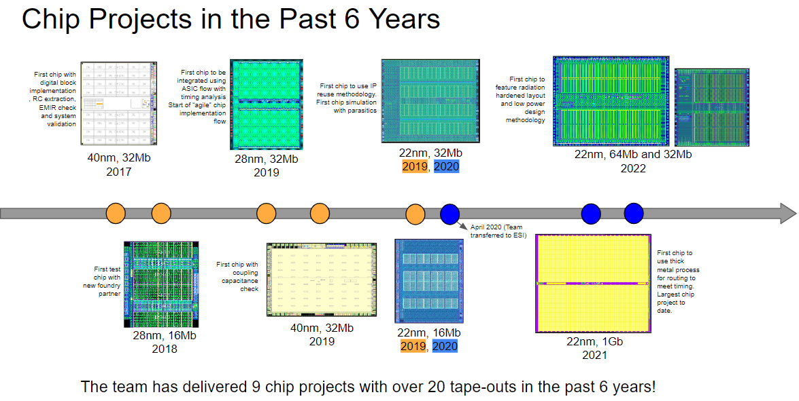

# Project Portfolio
Below are the projects I worked on for the past 6 years. I was the technical project manager for the majority of these projects where I was involved from the start upto tapeout. My day-to-day typically involves meeting various stakeholders e.g. clients, company ceo, physical design team, digital design team, and library characterization team and helping them remove road blocks and solve technical problems. 
In some of these, I was involved as technical resource mainly in charge of parasitic extraction, simulations and design review.

# On-going Projects
1. 2Gb chip
2. Integration of LavisPlus and RSCALC to existing physical design flow
3. Physical Design training for freshers
4. Formal verification of low power design

# MTC 3V, DTC 3V - 2020
Schedule: Jan 2020 - June 2020 (6 months)
The primary goal of the project was to create the physical implementation of two memory chips designed by our client. 
This was the first time that our company was tasked to deliver two chips with the schedule of one. To meet the project deliverables and schedule, I added more people to the team which increased the budget for human resources and workstations. 
Since the two designs are completely independent of each other (i.e. no common components or dependent deliverables), I was able to manage the teams separately. 
To track project progress, I created separate Gantt charts and task trackers for each team. 
I updated the charts and trackers daily

# 64Mb, 16Mb - 2022
Schedule: Jan 2022 - Dec 2022 (12 months)

# Rad Hardened Standard Cells Development - 2021
Schedule: Sept 2021 - Dec 2021 (4 months)

# Controller for ADPLL - 2021
Schedule: 

# 1Gb - 2020 to 2021
Schedule: Oct 2020 